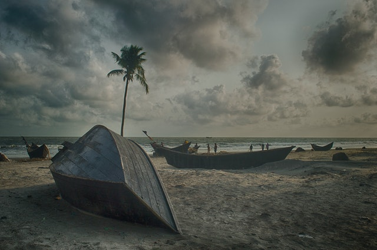
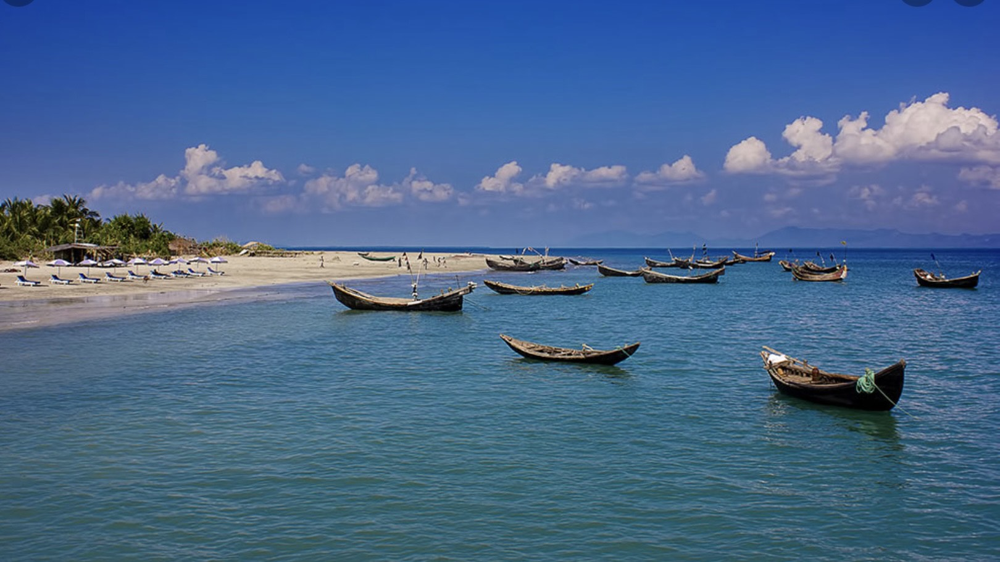

<!DOCTYPE html>
<html lang="en" dir="ltr">
  <head>
    <meta charset="utf-8">
    <title>FATEMATUN NUSRAT</title>
  </head>
  <body>
    <figure>

    
    
  </figure>

     
     
    

    <h1 align="center"> Bangladesh </h1>
    
Bangladesh is a country with abundant nature, from beaches,to forest and waterfall,coupled with rich culture and history.It is most the eighth-most popular country in the world. 

<h2> <i>Things to do in Bangladesh </i> </h2>
<figure align="center">
   
  <figcaption> <i>the cox's bazar </i> </figcaption>
   
  
The cox's bazar is a beach resort in the chittagong division in south-easther Bangladesh.It has one of the longest beaches in the world.There are 3 parts of cox's bazar. Many Tourist visit here to experience the beauty of nature and also to enjoy seafoods. There is a market called burmese market. This market is famous for handmade things and traditional saree and jewelary  

</figure>
 
 
 

  <figure align="center">
    
    <figcaption> <i>Saint Martin Island </i></figcaption>
     
    
 Saint martin" Island is a small island in the northeatern part of bangladesh.The beach of Saint Martain covered with beautiful coral. In this part of cox's bazar people go for scuba diving. There are many restuarents who serve traditional seafood.   

     
  </figure>

   
  

  <h3>Upcoming Events</h3>
  <ul>
  <li><a href="https://foursquare.com/v/burmese-market-coxs-bazar/5048447de4b06b90911734c8"> Cox's bazar- burmese market </a> </li>
  <li>  <a href="https://divezone.net/diving/saint-martin"> Scuba Diving  </a> </li>

  </ul>
 
 

<h3>Newsfeed</h3>
<h4> Cox's bazar: ready and waiting for more tourist</h4>

Bangladesh's domestic tourism arguably was born as the beach town of Cox's Bazar started to be recognised as a holiday destination, and it has been a bustling hub for tourists for many years now. And yet, it seems that all we hear about the town in the news is negative— unfair price hikes, lack of safety for female travellers, terrible roads, lack of overall security and all problems that could possibly plague a service industry-based town. But how much of this is true, is the question.

 
 
 

<h2>How much does a Bangladesh Trip Cost</h2>
<table>
  <tr aling="center">
    <td  width="200" bgcolor="skyblue"> </td>
    <td bgcolor="skyblue"> price</td>
  </tr>
  <tr aling="center">
    <td  width="200" >Ticket from JFK </td>
    <td bgcolor="purple" > $1230</td>
  </tr>
  <tr aling="center">
    <td  width="200" >hotels for 2 per night </td>
    <td>$100</td>
  </tr>
  <tr aling="center">
    <td  width="200"> Food Per person per day</td>
    <td > $60</td>
    <tr aling="center">
      <td >attaction and activist per person</td>
      <td>$150</td>
    </tr>
    <tr aling="center">
      <td  width="200" bgcolor="skyblue"> Total cost per day per person</td>
      <td bgcolor="skyblue"> $310</td>
    </tr>
  </tr>

  </table>

<h2 id="contact">contact us</h2>
<figure>
    017-878-72808

   
     email to <a href="mailto:fatematunsneha@gmail.com"> FATEMATUN NUSRAT</a>

     
      <a href= "https://www.instagram.com/explore/tags/coxbazar/">     follow us on instragram
 </a>
</figure>

 
     <nav align="center">
       <a href="visit1.html"> The cox's bazar</a>
       <a>|</a>
       <a href="Visit2.html">Saint Martin Island </a>
       <a>|</a>
       <a href="#contact">contact us</a>
     </nav>
      
     

     <footer align="center">All Meterial used to creat this website is only for education purpose.website created by :Fatematun Nusrat @2022</footer>
  </body>
</html>
